## Dictionary app
An application that makes language learning fun and engaging through reading.

### Tech stack:
- **Frontend**: htmx, jte, tailwindcss, JavaScript
- **Backend**: Java, Spring Boot
- **Database**: PostgreSQL

### How we work with the code:
### 1. Prefer immutable data:
- **Use records over classes for data transfer**
- **Classes are still fine for services and extending exceptions**
### 2. Prefer constructing via static factory method over "new" keyword
### ~~3. Do describe public APIs with interfaces~~ 
### 3. Records ARE interfaces
### 4. Each controller may depend on 1 injected service at most
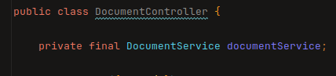

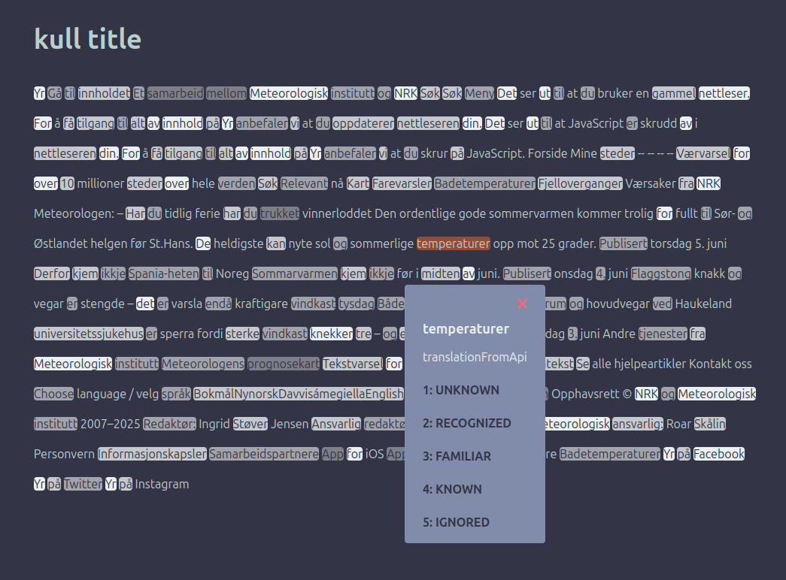

### 13/06/2025
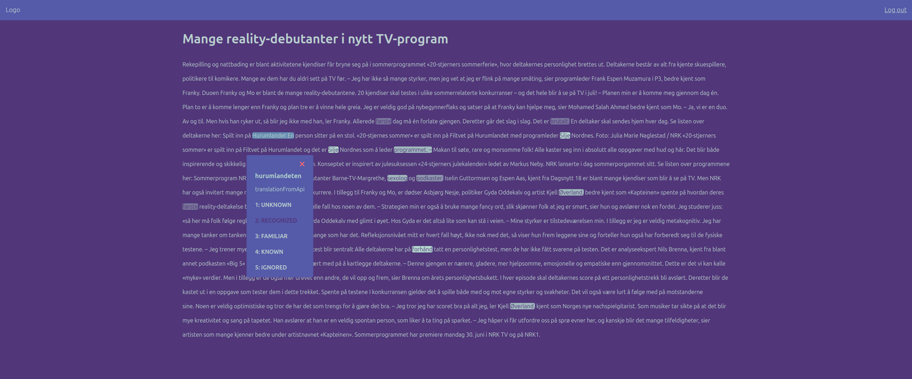
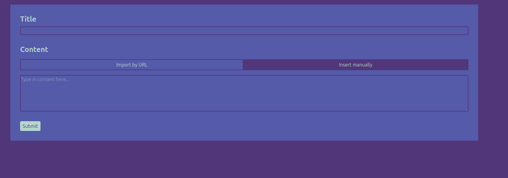
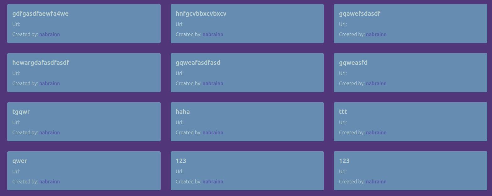
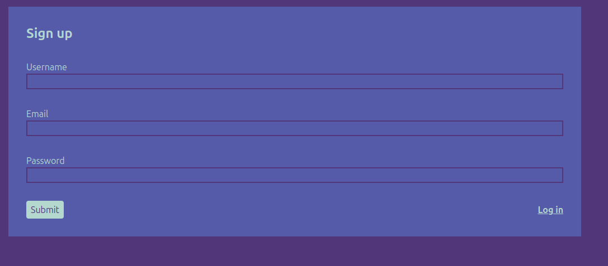

### 24/06/2025 - add or delete translations

### 26/06/2025 - pagination

### 01/07/2025 - AI translation integration

### 03/07/2025 - words learned, daily goal trackers

### 23/07/2025 - home page UI + improved navbar
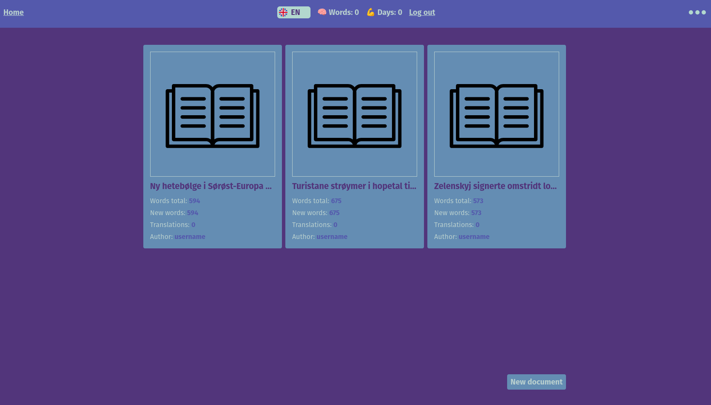

### document content preserving paragraphs
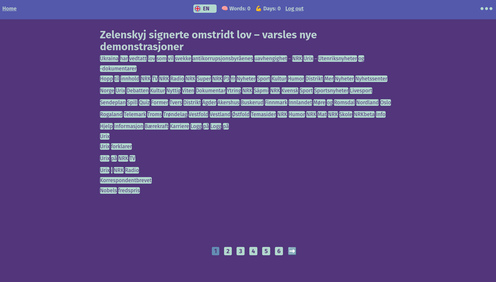

### translation form adaptive positioning depending on available space on screen
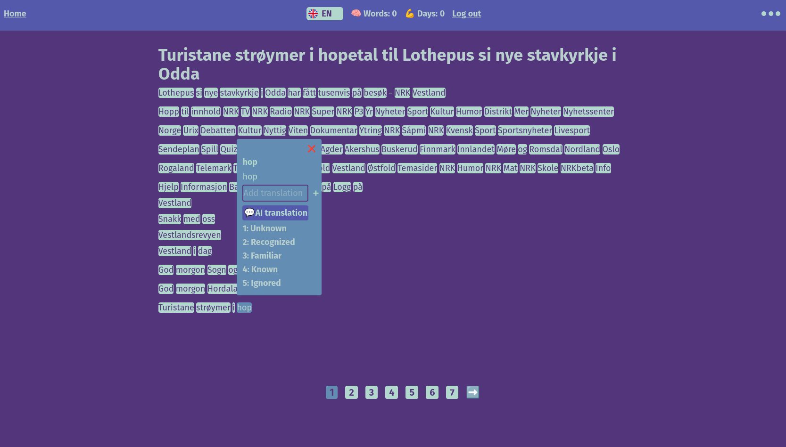
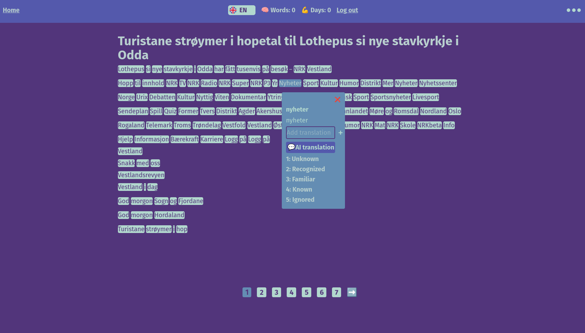

### mobile UI
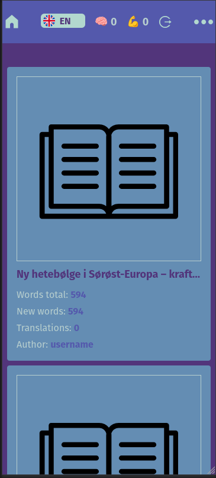
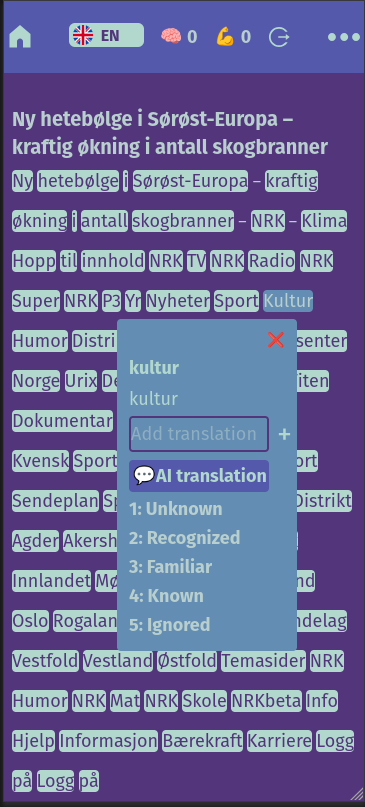

### 10/08/2025 - phrase selection feature
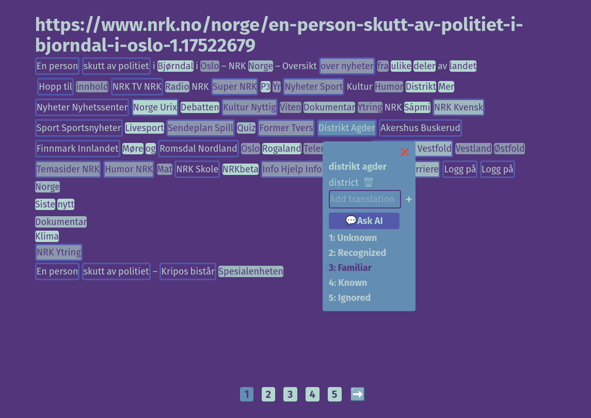

