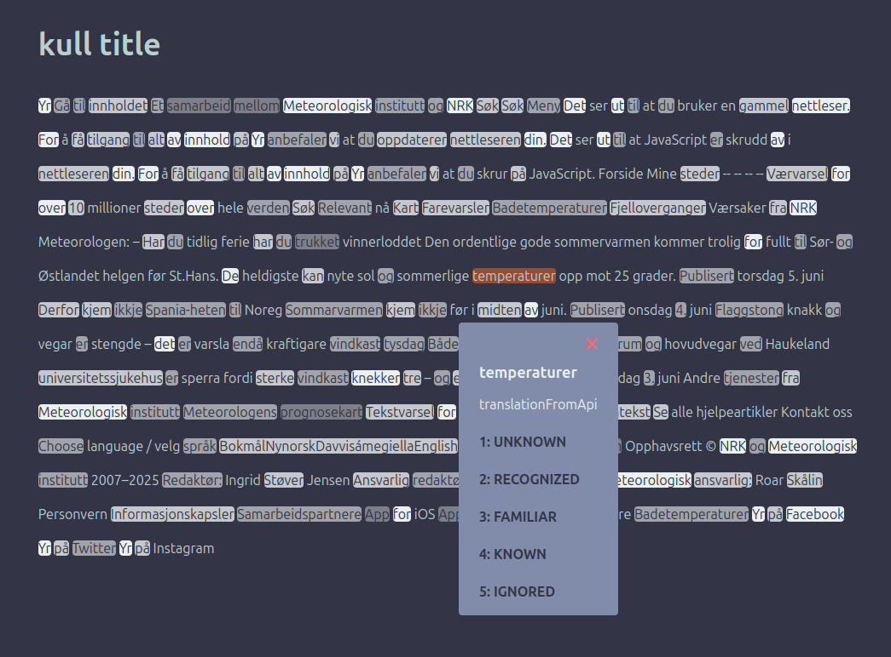

## Dictionary app
An application that makes language learning fun and engaging through reading.

### Tech stack:
- **Frontend**: htmx, jte, tailwindcss, JavaScript
- **Backend**: Java, Spring Boot
- **Database**: PostgreSQL

