## Dictionary app
An application that makes language learning fun and engaging through reading.

### Tech stack:
- **Frontend**: htmx, hyperscript, jte, tailwindcss, JavaScript
- **Backend**: Java, Spring Boot
- **Database**: PostgreSQL

### Codebase rulebook:
### 1. Prefer immutable data:
- **Always use records over classes for data transfer**
- **Classes are still fine for services exceptions**
- **Use wither methods on records for mutation, eg. user.withPassword(...)**
- **Only deal with setters when necessary, eg. custom Collector or library spec**
### 2. Always construct records with custom static factory method, eg. User.of(...)
### 3. No private methods
- **all implementations must be immediately visible**
- **for repeating operations, delegate to a service**
### 4. Each controller may depend on 1 injected service at most
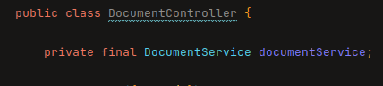
### 5. All request parameters MUST go into service for validation before being attached to the model
### Screenshots
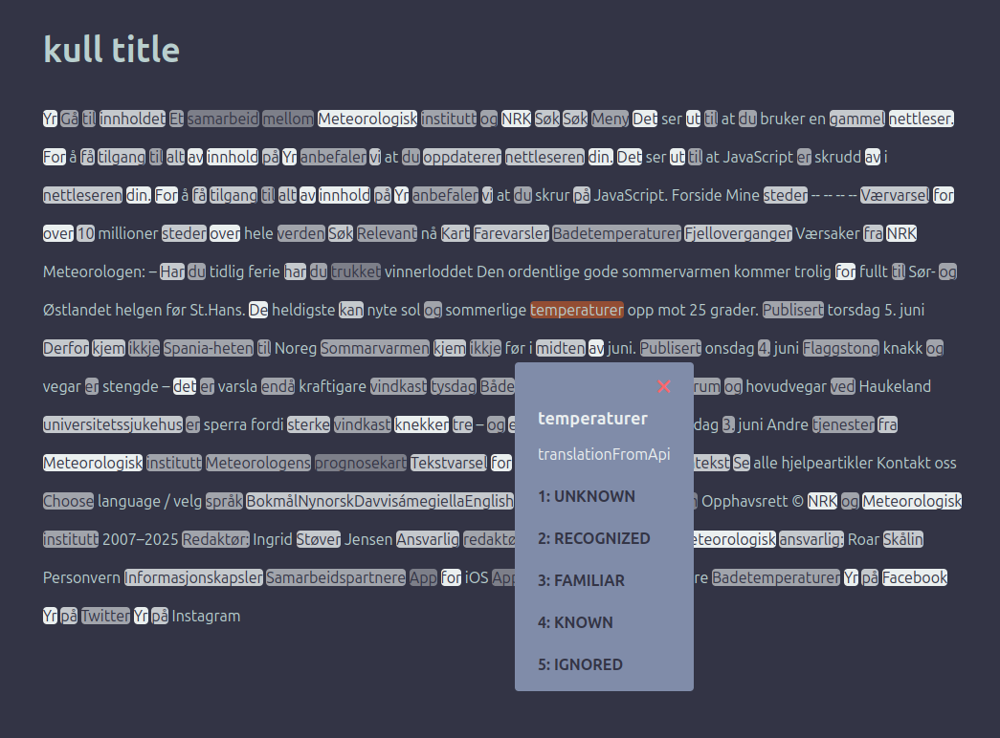

### 13/06/2025
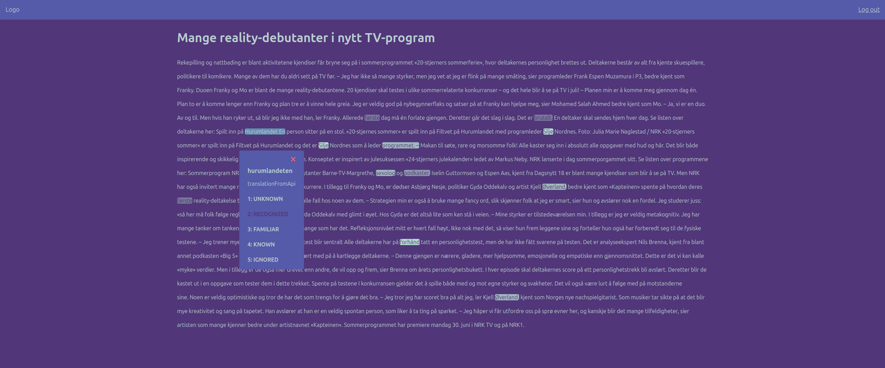
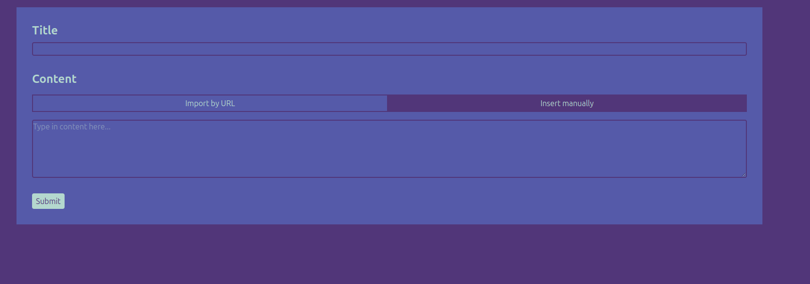
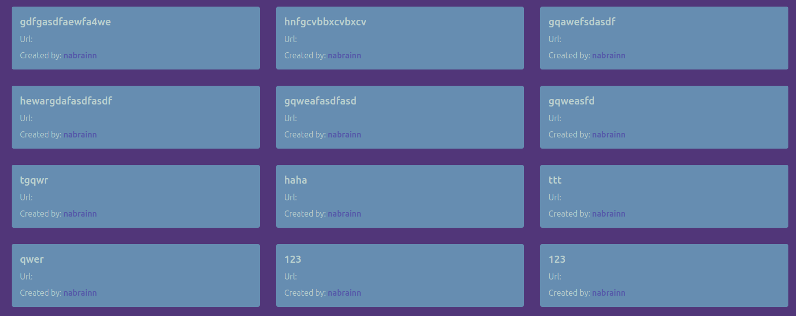
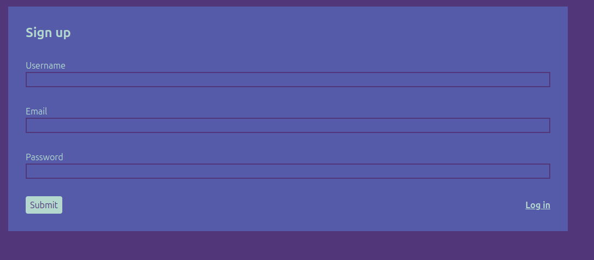

### 24/06/2025 - add or delete translations

### 26/06/2025 - pagination

### 01/07/2025 - AI translation integration

### 03/07/2025 - words learned, daily goal trackers

### 23/07/2025 - home page UI + improved navbar
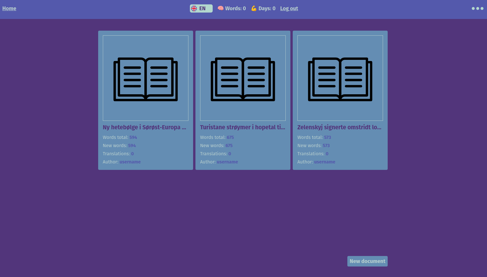

### document content preserving paragraphs
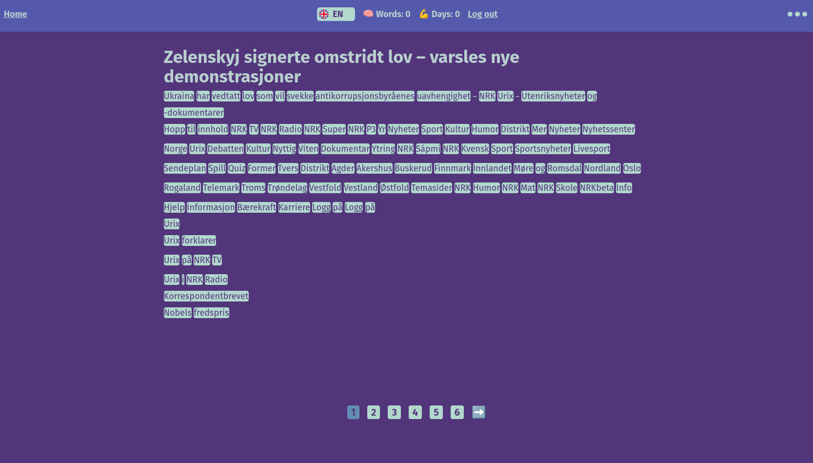

### translation form adaptive positioning depending on available space on screen
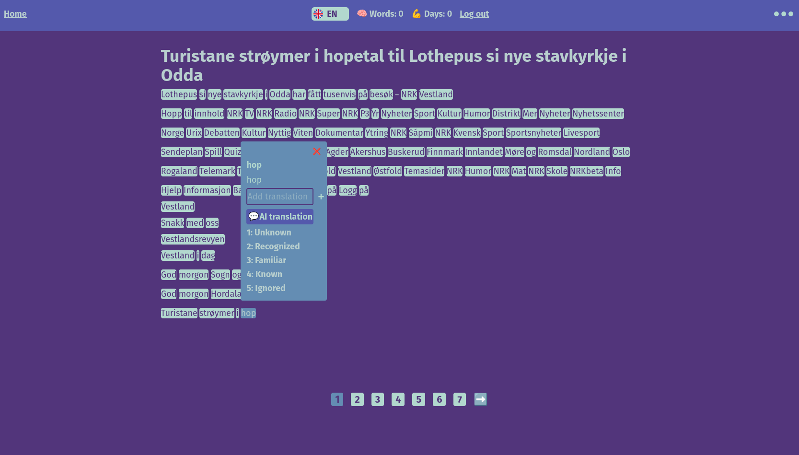
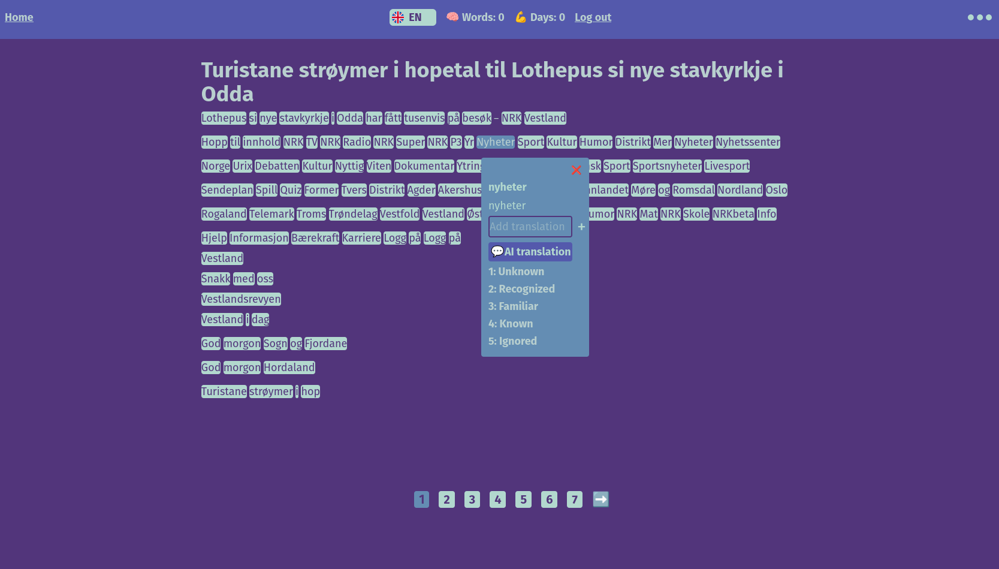

### mobile UI
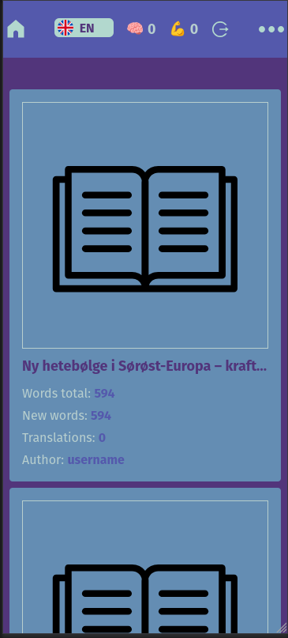
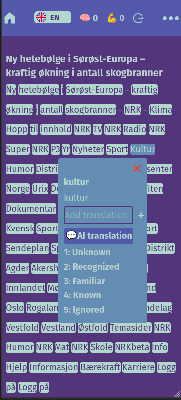

### 10/08/2025 - phrase selection feature
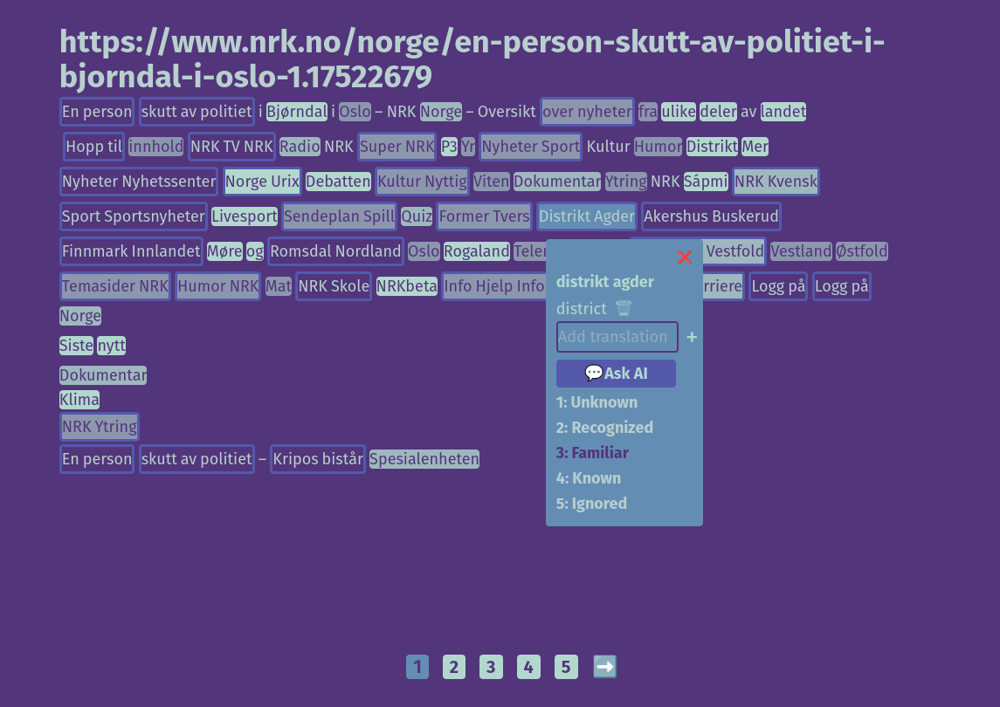

